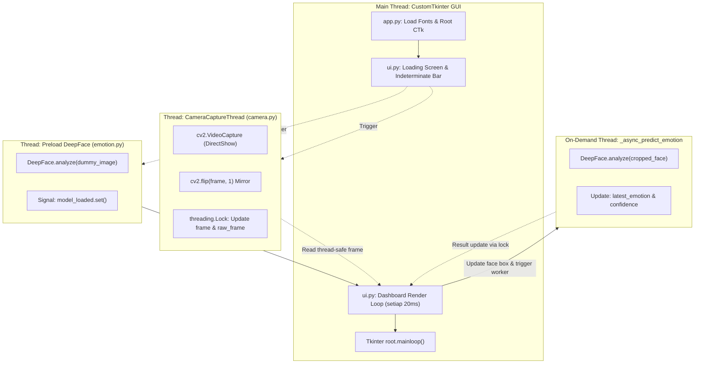

# 📋 DOKUMEN AUDIT LENGKAP PROYEK: EMOTION & GESTURE CHALLENGE (PYBLUR)

**Tanggal Audit:** 8 Oktober 2026  
**Status Audit:** Selesai (Comprehensive Codebase & Architecture Inspection)  
**Lingkungan Eksekusi:** Windows (Python 3.12, CustomTkinter, OpenCV, MediaPipe Tasks, DeepFace)

---

## 📑 DAFTAR ISI
1. [Ringkasan Eksekutif & Karakteristik Proyek](#1-ringkasan-eksekutif--karakteristik-proyek)
2. [Arsitektur Struktur Direktori & File](#2-arsitektur-struktur-direktori--file)
3. [Daftar Library & Dependensi (Tech Stack)](#3-daftar-library--dependensi-tech-stack)
4. [Arsitektur Sistem & Multi-Threading Pipeline](#4-arsitektur-sistem--multi-threading-pipeline)
5. [Mekanisme Detail Setiap Komponen & Modul](#5-mekanisme-detail-setiap-komponen--modul)
   - [5.1 Entry Point & Manajemen Font Dinamis (app.py)](#51-entry-point--manajemen-font-dinamis-apppy)
   - [5.2 Streaming Kamera Asinkron & Thread-Safe (camera.py)](#52-streaming-kamera-asinkron--thread-safe-camerapy)
   - [5.3 Deteksi Wajah & Inferensi Emosi (emotion.py)](#53-deteksi-wajah--inferensi-emosi-emotionpy)
   - [5.4 Hand Tracking & Geometric Gesture Recognizer (gesture.py)](#54-hand-tracking--geometric-gesture-recognizer-gesturepy)
   - [5.5 Game State & Grace-Period Timing Engine (game.py)](#55-game-state--grace-period-timing-engine-gamepy)
   - [5.6 Audio Sintesis Prosedural Tanpa File Eksternal (utils/helper.py)](#56-audio-sintesis-prosedural-tanpa-file-eksternal-utilshelperpy)
   - [5.7 UI Engine: Desain Sistem Neo-Brutalism (ui.py)](#57-ui-engine-desain-sistem-neo-brutalism-uipy)
   - [5.8 Konfigurasi Global & Parameter Desain (utils/config.py)](#58-konfigurasi-global--parameter-desain-utilsconfigpy)
6. [Alur Eksekusi Aplikasi (End-to-End Workflow)](#6-alur-eksekusi-aplikasi-end-to-end-workflow)
7. [Temuan Audit (Discrepancies, Code Quality & Keamanan)](#7-temuan-audit-discrepancies-code-quality--keamanan)
8. [Rekomendasi & Roadmap Pengembangan](#8-rekomendasi--roadmap-pengembangan)

---

## 1. RINGKASAN EKSEKUTIF & KARAKTERISTIK PROYEK

**Emotion & Gesture Challenge (Pyblur)** adalah aplikasi desktop interaktif berbasis Computer Vision (CV) dan Deep Learning (DL) yang dikembangkan dengan Python. Aplikasi ini memadukan **game tantangan (mini-game)** dengan analisis ekspresi wajah dan pengenalan gestur tangan secara *real-time*.

### Konsep Utama Game:
* Pemain diberikan **Misi Acak** berupa kombinasi:
  * **1 Ekspresi Emosi Wajah** (misal: *Happy* 😀, *Surprise* 😮, *Angry* 😡, dll.)
  * **1 Gestur Tangan** (misal: *Thumbs Up* 👍, *Peace* ✌, *Open Hand* 👋, *Fist* ✊)
* Pemain harus menahan pose emosi dan gestur yang sesuai di depan kamera selama **1.0 detik**.
* Jika berhasil, sistem memberikan skor **+10 poin**, memutar audio perayaan sintetis, dan memunculkan misi baru.
* Antarmuka visual mengusung gaya estetika **Neo-Brutalism** dengan kontras tegas, bayangan solid hitam, border tebal, dan palet warna ekspresif.

---

## 2. ARSITEKTUR STRUKTUR DIREKTORI & FILE

Berikut adalah pohon direktori aktual dari proyek:

```text
Pyblur/
├── app.py                     # Entry point utama; load font, init komponen, & Tkinter event loop
├── camera.py                  # Thread-safe webcam capture worker berbasis OpenCV DirectShow
├── emotion.py                 # Pipeline deteksi wajah Haar Cascade & inferensi DeepFace asinkron
├── gesture.py                 # MediaPipe Tasks HandLandmarker + rule-based classification geometris
├── game.py                    # Engine logika game: misi, evaluasi match, timer, grace period, skor
├── ui.py                      # UI Orchestrator CustomTkinter (Neo-Brutalist widgets & update loop)
├── requirements.txt           # Spesifikasi dependensi pustaka Python
├── README.md                  # Dokumentasi proyek pengguna
├── AUDIT_PROJECT.md           # [File ini] Hasil audit teknis komprehensif
├── screenshots/               # Folder output penyimpanan snapshot gambar kamera
├── assets/
│   ├── hand_landmarker.task   # Binary model pre-trained MediaPipe Tasks Hand Landmark (7.8 MB)
│   ├── fonts/                 # Berkas font kustom (Poppins, Kynetic Demo, Salmont, Themora)
│   ├── image/                 # Berkas grafis statis (logosmile.png)
│   ├── emoji/                 # Direktori emoji (disiapkan oleh config)
│   ├── icons/                 # Direktori icon (disiapkan oleh config)
│   └── sounds/                # Direktori audio (opsional, karena audio di-generate sintetis)
└── utils/
    ├── __init__.py            # Inisialisasi package utils
    ├── config.py              # Konfigurasi parameter global, warna brutalist, kamus emosi & gestur
    └── helper.py              # Sintesis audio berbasis NumPy/Pygame, fungsi utilitas screenshot
```

---

## 3. DAFTAR LIBRARY & DEPENDENSI (TECH STACK)

Berdasarkan [requirements.txt](file:///c:/xampp/htdocs/Pyblur/requirements.txt) dan pemindaian impor kode sumber, berikut rincian pustaka serta fungsinya:

| Pustaka / Dependensi | Versi Terpasang / Minimum | Kategori | Peran Spesifik dalam Aplikasi |
| :--- | :--- | :--- | :--- |
| **`opencv-python`** | `>=4.8.0` | Computer Vision | Mengakses webcam hardware via `cv2.VideoCapture` (DirectShow di Windows), konversi warna (BGR/RGB/GRAY), flipping horizontal frame, anotasi overlay HUD, dan klasifikasi wajah dengan Haar Cascade. |
| **`mediapipe`** | `==0.10.35` | Machine Learning | Menggunakan API modern **MediaPipe Tasks Python (`mp_vision.HandLandmarker`)** untuk melacak 21 titik koordinat 3D sendi tangan menggunakan berkas model `hand_landmarker.task`. |
| **`deepface`** | `>=0.0.92` | Deep Learning | Mengklasifikasikan ekspresi emosi dari potongan gambar wajah (7 kelas: *happy, sad, angry, neutral, surprise, fear, disgust*). |
| **`tf-keras`** | *Latest* | Backend Framework | Runtime Keras/TensorFlow yang diandalkan oleh model DeepFace untuk eksekusi bobot neural network. |
| **`numpy`** | `>=1.24.0` | Numerical Computing | Manipulasi array matriks citra piksel, komputasi bounding box, dan sintesis matematika bentuk gelombang audio (sinusoidal, white noise burst, envelope fade-out). |
| **`pygame`** | `>=2.5.0` | Multimedia / Audio | Memanfaatkan submodul `pygame.mixer` dan `pygame.sndarray` untuk memutar audio PCM buffer secara low-latency tanpa perlu memuat berkas audio eksternal (`.wav`/`.mp3`). |
| **`customtkinter`** | `>=5.2.0` | GUI Framework | Toolkit UI modern berbasis Tkinter untuk menyusun antarmuka grafis dark/light mode dengan styling Neo-Brutalism custom. |
| **`pillow (PIL)`** | `>=10.0.0` | Image Processing | Menjembatani konversi format matriks citra NumPy/OpenCV menjadi objek `CTkImage` yang dapat dirender ke dalam komponen GUI Tkinter. |
| **`ctypes`** *(Built-in)* | Standar Python | OS System Interop | Memanggil Windows API `gdi32.dll` (`AddFontResourceExW`) untuk mendaftarkan berkas font `.ttf`/`.otf` langsung ke sesi proses secara runtime. |
| **`urllib.request`** *(Built-in)* | Standar Python | Jaringan / HTTP | Mengunduh font Google Poppins secara otomatis dari GitHub jika belum tersedia di folder lokal. |
| **`threading`** *(Built-in)* | Standar Python | Concurrency | Manajemen multi-threading untuk mencegah freezing UI akibat operasi kamera I/O dan inferensi DeepFace. |

---

## 4. ARSITEKTUR SISTEM & MULTI-THREADING PIPELINE

Salah satu keunggulan teknis dari proyek ini adalah **pemisahan proses ke dalam arsitektur multi-threading terisolasi**, sehingga beban komputasi Computer Vision dan Neural Network tidak mengunci (freeze) antarmuka Tkinter.

### Diagram Alur Konkurensi Multi-Threading:



### Rincian Pembagian Thread:
1. **Main UI Thread**: Bertanggung jawab atas rendering CustomTkinter, penanganan tombol keyboard/mouse, dan pembaruan elemen grafis melalui fungsi `update_loop()` yang dipanggil rekursif setiap **20 milidetik** (`root.after(20, self.update_loop)`).
2. **`CameraCaptureThread` (Daemon)**: Melakukan loop penangkapan frame dari hardware webcam secara berkelanjutan dengan interval tidur 10ms, menghitung rolling FPS, dan menyimpannya ke memori bersama yang dilindungi `threading.Lock()`.
3. **`_preload_model` (Pre-warming Thread)**: Mengunduh dan memuat bobot model DeepFace pada saat startup menggunakan matriks dummy `(100, 100, 3)`. Memberikan sinyal `threading.Event()` (`model_loaded`) setelah siap.
4. **`_async_predict_emotion` (Dynamic Worker Thread)**: Karena inferensi DeepFace memerlukan waktu komputasi intensif (100–300ms per frame), proses ini dijalankan di thread terpisah setiap kali ada wajah baru terdeteksi dan tidak ada inferensi aktif lainnya (`is_processing == False`).

---

## 5. MEKANISME DETAIL SETIAP KOMPONEN & MODUL

### 5.1 Entry Point & Manajemen Font Dinamis (`app.py`)
* **UTF-8 Output Enforcement**: Memaksa terminal Windows menggunakan `PYTHONIOENCODING="utf-8"` untuk mencegah error `UnicodeEncodeError` saat menampilkan emoji log di console.
* **Win32 Runtime Font Loader**: 
  * Memeriksa keberadaan font `Poppins-Regular.ttf` dan `Poppins-Bold.ttf`. Jika tidak ditemukan, script otomatis mengunduh font dari repositori resmi Google Fonts via `urllib.request`.
  * Memanfaatkan fungsi Windows C-Library `ctypes.WinDLL('gdi32.dll').AddFontResourceExW(path, 0x10, 0)` (`FR_PRIVATE = 0x10`). Font didaftarkan privat hanya untuk proses aplikasi yang sedang berjalan, tanpa perlu di-install secara global ke sistem Windows oleh administrator.
* **Fallback Font Safety**: Diuji ketersediaannya pada `AppUI.__init__`. Jika font `Kynetic Demo Black` tidak ditemukan di sistem, aplikasi otomatis fallback ke `Segoe UI`, `Helvetica`, atau `Arial` tanpa mengalami crash.

### 5.2 Streaming Kamera Asinkron & Thread-Safe (`camera.py`)
* **Inisialisasi Backend**: Menggunakan flag `cv2.CAP_DSHOW` (DirectShow) di lingkungan Windows guna mempercepat *handshake* hardware webcam dan menghindari latensi startup kamera.
* **Penyimpanan Ganda (`frame` & `raw_frame`)**:
  * `raw_frame`: Citra asli bersih tanpa anotasi HUD (digunakan saat mengambil screenshot).
  * `frame`: Citra kerja untuk pemrosesan dan overlay.
* **Perhitungan FPS Dinamis**: Dihitung dengan algoritma Exponential Moving Average:
  $$\text{FPS}_{baru} = 0.9 \times \text{FPS}_{lama} + 0.1 \times \left(\frac{1}{\Delta t}\right)$$

### 5.3 Deteksi Wajah & Inferensi Emosi (`emotion.py`)
* **Haar Cascade Face Detection**:
  * Menggunakan file cascade standar OpenCV: `haarcascade_frontalface_default.xml`.
  * Parameter deteksi: `scaleFactor=1.05`, `minNeighbors=3`, `minSize=(48, 48)`. Ambang batas ini telah direlaksasi agar deteksi wajah tetap stabil saat pengguna sedikit menunduk atau menoleh.
  * Mengambil wajah terbesar jika terdapat lebih dari satu orang di dalam frame: `max(faces, key=lambda f: f[2] * f[3])`.
* **Mekanisme Grace Period Wajah (`FACE_GRACE_SECONDS = 1.5`)**:
  * Jika dalam 1–2 frame wajah terhalang atau gagal dideteksi Haar Cascade sesaat (flicker), bounding box wajah sebelumnya tetap dipertahankan selama **1.5 detik**. Hal ini mencegah terputusnya hitungan timer pada game.
* **Klasifikasi Emosi DeepFace**:
  * Fungsi: `DeepFace.analyze(cropped, actions=["emotion"], enforce_detection=False, silent=True)`.
  * Menghasilkan emosi dominan (`dominant_emotion`) serta persentase keyakinan (`confidence`).

### 5.4 Hand Tracking & Geometric Gesture Recognizer (`gesture.py`)
* **MediaPipe Tasks API**: Menggunakan model `hand_landmarker.task` yang berjalan dalam mode per-frame `RunningMode.IMAGE`.
* **Klasifikasi Gestur Berbasis Aturan Geometris (Rule-Based Heuristic)**:
  Sistem mengevaluasi posisi koordinat normalisasi titik sendi ujung jari (*TIP*) terhadap sendi perantara (*PIP*):
  * **Ujung Jari vs Sendi**:
    * Telunjuk terangkat jika: $Y_{\text{tip}} < Y_{\text{pip}}$ (koordinat Y layar bergerak ke bawah).
  * **Kondisi Gestur**:
    1. **Fist ✊**: Telunjuk, jari tengah, jari manis, dan kelingking semuanya terlipat ke bawah.
    2. **Thumbs Up 👍**: Keempat jari utama terlipat, namun ujung ibu jari (landmark 4) terangkat tinggi di atas sendi (landmark 3) dan di atas sendi jari telunjuk (landmark 6).
    3. **Peace ✌**: Jari telunjuk dan jari tengah terangkat ke atas, sedangkan jari manis dan kelingking terlipat.
    4. **Open Hand 👋**: Seluruh keempat jari (telunjuk, tengah, manis, kelingking) terangkat penuh.
    5. **Unknown ❓**: Kombinasi jari di luar aturan di atas.

### 5.5 Game State & Grace-Period Timing Engine (`game.py`)
* **Challenge Generator**: Memilih kombinasi baru secara acak dari daftar `EMOTIONS` (7 item) dan `GESTURES` (4 item). Menggunakan loop pengecekan agar misi yang baru tidak pernah sama dengan misi sebelumnya.
* **Evaluasi Kecocokan**:
  $$\text{Match} = (\text{Emosi Terdeteksi} == \text{Target Emosi}) \land (\text{Gestur Terdeteksi} == \text{Target Gestur})$$
* **Hold Timer & Mismatch Grace (`MISMATCH_GRACE = 0.5s`)**:
  * Durasi penahanan yang diperlukan: **1.0 detik** (`CHALLENGE_HOLD_DURATION = 1.0`).
  * Jika pemain sudah menahan pose tetapi gestur atau emosi hilang sesaat (flickering detektor), sistem tidak langsung membatalkan timer, melainkan memberikan toleransi waktu (grace period) selama **0.5 detik**. Jika pemain kembali ke pose sebelum 0.5 detik berakhir, timer penahanan tetap berlanjut.

### 5.6 Audio Sintesis Prosedural Tanpa File Eksternal (`utils/helper.py`)
Aplikasi tidak bergantung pada file audio eksternal `.wav` atau `.mp3`. Seluruh audio dihasilkan langsung dari persamaan matematika menggunakan NumPy dan dikonversi ke format 16-bit PCM Stereo:
1. **Suara "Correct" (Chime Sukses Misi)**:
   * Kombinasi dua nada berurutan (Double Beep):
     * Bagian pertama: Frekuensi nada **C5** ($523.25\text{ Hz}$).
     * Bagian kedua: Frekuensi nada **E5** ($659.25\text{ Hz}$).
   * Diberi *linear fade-out* pada 10% durasi terakhir agar suara terdengar natural dan tidak terjadi bunyi *click/pop*.
2. **Suara "Screenshot" (Shutter Kamera)**:
   * Menggunakan kombinasi derau putih acak (*uniform white noise*) dikalikan dengan kurva peluruhan eksponensial cepat:
     $$A(t) = \text{Noise} \times e^{-50t}$$
3. **Playback Low-Latency**:
   * Data dikonversi menjadi integer 16-bit: `audio = (tone * 16384).astype(np.int16)`.
   * Diputar langsung melalui `pygame.sndarray.make_sound(stereo_audio).play()`.

### 5.7 UI Engine: Desain Sistem Neo-Brutalism (`ui.py`)
UI dirancang dengan konsep **Neo-Brutalism**:
* **Karakteristik Visual**: Warna latar acid yellow (`#e9b50a`), kontras hitam pekat (`#000000`), border tebal 2px tanpa bevel, kartu berbayang tegas (*solid drop-shadow*).
* **Teknik Bayangan Solid CustomTkinter (`_brute_frame` & `_brute_btn`)**:
  * Menggunakan sistem kontainer proxy grid 1x1.
  * Layer bayangan diletakkan di koordinat `padx=(offset, 0), pady=(offset, 0)` dengan warna hitam murni.
  * Kartu depan diletakkan di koordinat `padx=(0, offset), pady=(0, offset)` dengan warna latar kartu.
  * Teknik ini menciptakan bayangan sudut keras tanpa bergantung pada library grafis eksternal.
* **Canvas Overlay Render**:
  * Menampilkan kotak deteksi wajah berwarna Coral (`#EA5522`) dan kotak gestur berwarna Mint (`#1E824C`).
  * Menampilkan indikator titik bulat "MATCH!" (Hijau) atau "NO MATCH" (Merah) di pojok kiri bawah video.

### 5.8 Konfigurasi Global & Parameter Desain (`utils/config.py`)
* Mengatur konstanta global aplikasi:
  * Dimensi webcam: `640 x 480 piksel`.
  * Palet warna brutalist: `BG_COLOR`, `PANEL_COLOR`, `CARD_COLOR`, `BORDER_COLOR`, `ACCENT_COLOR`, `PURPLE_COLOR`, `MINT_COLOR`, `GOLD_COLOR`, `BLUE_COLOR`.
  * Pemetaan emoji untuk 7 emosi wajah dan 5 gestur tangan.

---

## 6. ALUR EKSEKUSI APLIKASI (END-TO-END WORKFLOW)

```text
[1. User menjalankan 'python app.py']
                 │
                 ▼
[2. load_custom_fonts()]
  ├── Download Poppins jika belum ada
  └── Register font TTF/OTF via Windows GDI32
                 │
                 ▼
[3. Inisialisasi Objek: Camera, EmotionDetector, GestureRecognizer, ChallengeGame, AppUI]
                 │
                 ▼
[4. Tampilan Loading Screen (CustomTkinter Indeterminate Progress Bar)]
  ├── Thread Background: Camera.start()
  └── Thread Background: Pre-warming DeepFace (Dummy Image)
                 │
                 ▼
[5. DeepFace model_loaded Event terpicu ──► Dashboard Neo-Brutalism Dibangun]
                 │
                 ▼
[6. UI Update Loop (Berjalan setiap 20ms)]
  ├── Ambil frame kamera dari CameraCaptureThread (thread-safe)
  ├── gesture_recognizer.process_frame() ──► Hitung landmark & klasifikasi gestur
  ├── emotion_detector.update() ──► Deteksi wajah Haar Cascade & schedule async DeepFace
  ├── game.update(emotion, gesture) ──► Evaluasi kesesuaian target misi
  │     ├── Jika MATCH: Jalankan timer hold (Target 1.0s)
  │     └── Jika HOLD SELESAI: Tambah Skor (+10), Bunyikan audio chime, Buat Misi Baru
  ├── Render bounding box & label HUD ke dalam frame
  ├── Konversi frame BGR -> RGB -> PIL Image -> CTkImage
  └── Tampilkan frame ke CTkLabel video pane & perbarui status sidebar (Skor, Misi, FPS)
```

---

## 7. TEMUAN AUDIT (DISCREPANCIES, CODE QUALITY & KEAMANAN)

Berikut adalah temuan penting dari hasil audit mendalam terhadap kode sumber dan perbandingannya dengan dokumentasi yang ada:

### ⚠️ 1. Ketidaksesuaian Antara README.md dan Kode Sumber Aktual (Discrepancies)
1. **Pemicu Gestur Shortcut Dinonaktifkan**:
   * *Di README.md:* Menyebutkan gestur **Thumbs Up (👍)** mengambil tangkapan layar, **Peace (✌)** mengganti filter kamera, **Open Hand (👋)** mereset game, dan **Fist (✊)** menghentikan game.
   * *Di Kode Aktual ([ui.py](file:///c:/xampp/htdocs/Pyblur/ui.py#L467-L481)):* Baris logika pada metode `_dispatch_gesture` untuk shortcut screenshot **dikomentari (commented out)**, dan logika penggantian filter kamera tidak diimplementasikan. Hal ini sengaja dihindari agar saat pemain memainkan misi, gestur tidak memicu efek samping yang membingungkan.
2. **Durasi Penahanan Misi (Hold Duration)**:
   * *Di README.md:* Tertulis **2.0 detik**.
   * *Di Kode Aktual ([utils/config.py](file:///c:/xampp/htdocs/Pyblur/utils/config.py#L50)):* Nilai `CHALLENGE_HOLD_DURATION` adalah **1.0 detik**. Nilai ini jauh lebih responsif dan ramah pengguna untuk model real-time.
3. **Teknologi Deteksi Wajah**:
   * *Di README.md:* Tertulis menggunakan MediaPipe untuk deteksi wajah.
   * *Di Kode Aktual ([emotion.py](file:///c:/xampp/htdocs/Pyblur/emotion.py#L27-L29)):* Menggunakan **OpenCV Haar Cascade Classifier** (`haarcascade_frontalface_default.xml`), sedangkan MediaPipe dikhususkan untuk pelacakan tangan (`gesture.py`).

### 🛡️ 2. Kualitas Kode & Penanganan Konkurensi (Positif)
* **Pencegahan GUI Freezing Sangat Baik**: Penerapan `threading.Event()` (`model_loaded`) berhasil menyelesaikan potensi race condition di mana dashboard sebelumnya bisa terbuka sebelum model DeepFace siap di memori.
* **Thread-Safety Terjamin**: Variabel bersama pada `Camera` dan `EmotionDetector` dilindungi oleh `threading.Lock()`.
* **Zero External Audio Dependency**: Pendekatan sintesis audio NumPy + Pygame sangat efisien karena menghilangkan risiko error missing file `.wav`.
* **Grace Period Stabilisation**: Penambahan `FACE_GRACE_SECONDS` (1.5 detik) dan `MISMATCH_GRACE` (0.5 detik) membuat permainan terasa mulus tanpa gangguan akibat kedipan frame kamera (detection jitter).

---
---
*Laporan audit ini digenerasi secara otomatis dan akurat berdasarkan inspeksi kode sumber proyek Pyblur.*
